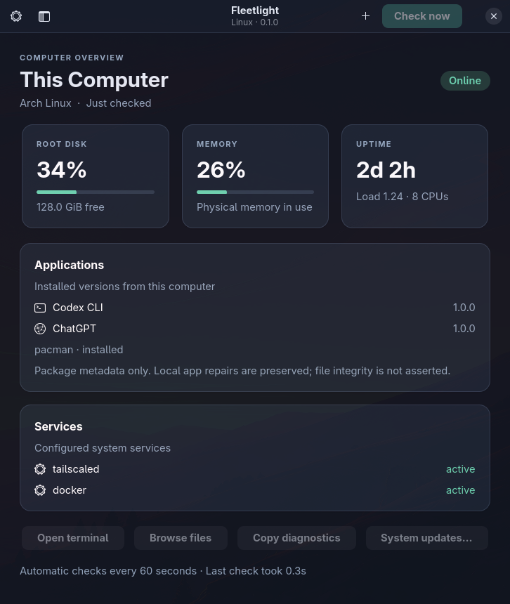

# Fleetlight for Linux

A native GTK4/libadwaita dashboard for your computers. Monitor Linux and macOS hosts from a Linux desktop, using the SSH access you already have.

Hosts marked `"local": true` refresh memory, load, disk space and uptime every two seconds. On Linux this lightweight refresh reads kernel files directly without launching commands. Full host checks, services and installed software retain the configured `refresh_seconds` interval (60 seconds by default); release checks and history writes keep their existing schedules. This applies to the current computer on every Linux installation configured with a local host.



## Version 0.3.6

- Optional automatic updates from Settings: Codex CLI, ChatGPT and Linux packages install as soon as checks find them. Off by default. Computers are not restarted automatically.

## Version 0.3.5

- Show remaining Codex and Cursor quota from this computer’s signed-in sessions. Settings can show or hide each agent.

## Version 0.3.2

- Show CPU temperature in Celsius for Linux hosts with readable Intel/AMD CPU sensors or supported CPU thermal zones. Local readings update every two seconds; remote readings arrive with normal SSH checks. Missing sensors and macOS currently show “CPU sensor unavailable”; no privileged sensor commands are run.

- Refresh local memory, load, disk space and uptime every two seconds with lightweight collection.
- Show the current computer first in the fleet sidebar, preserving the other computers' order.

### Existing features

- A Wayland-native desktop application with a searchable fleet sidebar, attention filter and automatic checks.
- Optional automatic Codex CLI, ChatGPT and Linux package updates from Settings. Off by default; computers are not restarted automatically.
- Show remaining Codex and Cursor quota from this computer's signed-in sessions, with Settings toggles for each agent.
- Direct, concurrent SSH monitoring. The local computer is checked without SSH.
- Root disk, memory, uptime, load, configured systemd services, Codex CLI and ChatGPT package versions.
- Installed/latest application versions and in-app Codex CLI and ChatGPT update buttons, including remote Apple Silicon Macs.
- Fleet-wide Linux package updates and confirmed restarts, with new-boot verification.
- Durable update jobs with progress, verification and reconnect recovery.
- Per-service **Warn when stopped** preferences for optional services.
- A local history of status and service transitions, with recent changes on each computer's page.
- Explicit terminal, SFTP and copy-diagnostics actions.
- System package updates in an interactive terminal after confirmation. Omarchy uses `omarchy update` (system packages, AUR, keyrings, migrations and mise). Other Arch hosts use a full `pacman -Syu`. APT and DNF are also supported. Fleetlight never answers the package manager's confirmation prompt.
- Editable private configuration, an add-computer dialog and optional start at login.
- A read-only JSON CLI for diagnostics, plus a fictional demo mode for screenshots.

The Linux edition does not yet provide tray integration, Android controller pairing or wake-on-LAN. The Linux app monitors hosts directly and does not depend on a Mac controller.

## Install

Requires Python 3.10+, GTK4, libadwaita 1.4+ and OpenSSH. Remote computers require Python 3.9+ and a working, non-interactive SSH connection. Tested on Arch/Omarchy under Hyprland; CI uses Ubuntu 24.04 with Xvfb.

Arch / Omarchy:

```sh
sudo pacman -S --needed python python-gobject gtk4 libadwaita openssh
```

Ubuntu 24.04+ / Debian with libadwaita 1.4+:

```sh
sudo apt install python3 python3-gi gir1.2-gtk-4.0 gir1.2-adw-1 openssh-client
```

Then:

```sh
git clone https://github.com/spirosrap/fleetlight-linux.git
cd fleetlight-linux
bash scripts/install.sh
~/.local/bin/fleetlight
```

The installer does not need sudo. It installs the app, icon and desktop launcher under `~/.local/`. Existing user configuration stays intact; the previous installed source is retained in `~/.local/share/fleetlight.previous` after an upgrade. Choose **Fleetlight** in your desktop application launcher. A terminal such as foot, kitty, GNOME Terminal or Konsole is needed for terminal actions; SFTP browsing requires a compatible file manager.

For development, run `python3 -m fleetlight` from the checkout. Use your distribution's system Python so it can find PyGObject; an isolated pip virtual environment will not normally include the system GI bindings. See the [PyGObject installation guide](https://pygobject.gnome.org/getting_started.html) and [libadwaita documentation](https://gnome.pages.gitlab.gnome.org/libadwaita/doc/main/).

## Configure your fleet

The public app starts with **This Computer only**. It never imports or probes your SSH hosts automatically. Add machines with the **+** button, or edit **Settings**. Configuration lives in `$XDG_CONFIG_HOME/fleetlight/fleet.json` (normally `~/.config/fleetlight/fleet.json`):

```json
{
  "version": 1,
  "refresh_seconds": 60,
  "auto_updates": false,
  "hosts": [
    {"id": "local", "name": "This Computer", "local": true, "services": []},
    {"id": "server", "name": "Home Server", "alias": "home-server", "services": ["tailscaled", "docker"]}
  ]
}
```

SSH aliases are resolved by OpenSSH using your normal `~/.ssh/config`. Verify a new host's fingerprint and establish key-based authentication in your terminal before adding it. Fleetlight uses `BatchMode=yes` and `StrictHostKeyChecking=yes`; it never bypasses unknown or changed keys. Connection errors are shown separately from service failures.

Service names refer to system-level systemd units. macOS service checks are currently unsupported. A missing configured service is reported as **not installed**, not healthy. Host probes run at most eight at once, time out after 25 seconds and never require sudo. Codex version lookup follows common system, mise and nvm paths. Application release checks run separately and refresh package metadata.

Services are expected to run unless you turn off **Warn when stopped**. Optional services remain visible; inactive or uninstalled optional services are neutral, while an actual failed service still needs attention. Settings stores these preferences in each host's `optional_services` list.

System updates can overwrite local application repairs. Confirmed terminal updates leave package selection, authentication and final confirmation to you. Unattended Linux package updates only run from **Update all Linux packages** or from Settings automatic updates, using existing passwordless sudo.

History is stored locally in `$XDG_STATE_HOME/fleetlight/history.json`, capped at 2,048 samples / 24 hours and 100 events. It contains computer IDs, metrics and state changes. Diagnostics copied to the clipboard include computer names and should be reviewed before sharing.

## Application updates

**Check now** checks installed and available releases. Host monitoring runs every minute by default; automatic application release checks run every 15 minutes. Select a computer and press **Update** beside an available application release. ChatGPT asks for confirmation because it may close and reopen the app; Arch also requires a full system upgrade to avoid unsupported partial upgrades.

- **Codex CLI, Linux and macOS:** uses the active installation's standalone updater, npm or mise. Stable versions come from the official npm registry. Unknown installation methods require a manual update.
- **ChatGPT on Apple Silicon macOS:** checks OpenAI's official appcast, verifies the downloaded bundle's identity, version and OpenAI signing team, and restores the previous bundle if replacement verification fails.
- **ChatGPT on Arch:** refreshes isolated package metadata, checks package integrity and runs a full `omarchy update` on Omarchy, or `pacman -Syu` on other Arch hosts, after confirmation. Modified packages are protected from this action.
- **ChatGPT on APT:** validates the supported official repository and installed package, refreshes metadata and upgrades the package. Linux installation requires existing passwordless sudo permission; Fleetlight does not collect passwords or configure sudo.

**Update all Codex CLI** and **Update all ChatGPT** show the number of eligible fleet updates. Each button opens a review with the computers and versions to update, plus skipped computers (current, offline, protected or unchecked). Batches run sequentially, stop on failure, and offer **Stop after current update** to cancel remaining work without interrupting an installer. The queue is saved alongside the active job and resumes after a controller restart.

**Update all Linux packages** refreshes package metadata and upgrades eligible Omarchy, Arch, APT and DNF computers using existing passwordless sudo. On Omarchy this is the full `omarchy update -y` path, including AUR packages. Services may restart, but computers are never automatically rebooted by an update batch. When system updates are pending, locally modified ChatGPT packages protect the host from the batch; review those system upgrades manually.

**Automatically install all available updates** in Settings turns on unattended Codex CLI, ChatGPT and Linux package installs after the usual release checks. It stays off until you enable it. Keep Fleetlight open (start at login is useful). Automatic updates run one at a time, skip a computer that fails, and do not retry that same update until you restart Fleetlight or the available packages change. Restarts are never automatic.

**Restart required computers** reviews computers with an OS reboot flag, a replaced running Arch kernel, a `needs-restarting` request, or a core-package restart recommendation recorded by Fleetlight. Each confirmed restart is scheduled with a one-minute delay; the local controller goes last. Scheduling is not reported as a verified reboot: Fleetlight waits for the computer to return with a different Linux boot ID. Open Fleetlight again after restarting its own computer (or enable start at login) to see the verification. These checks cannot identify every third-party application's restart requirement.

Updates run one at a time in Fleetlight. Jobs continue after an SSH interruption or controller crash, and Fleetlight resumes watching the saved job when reopened. It verifies the active version before reporting success. Job state and logs are retained on each target at `~/.local/state/fleetlight/update-jobs`; controller receipts are in the local state folder. Do not remove these while a job is running. Package-manager locks also apply; do not run competing manual updates.

Fleetlight itself can be updated by pulling this repository and rerunning `bash scripts/install.sh` after closing the app. Its own updater is not yet integrated.

## Command line

```sh
python3 -m fleetlight --check
python3 -m fleetlight --config /path/to/private-config.json --check
python3 -m fleetlight --demo
python3 -m fleetlight --version
```

`--check` returns status 0 only when every configured host returns a verified probe receipt. It does not assert that every service is healthy. Demo mode performs no network checks and uses fictional data.

## Test

```sh
python3 -m unittest discover -s tests -v
python3 scripts/privacy_check.py
dbus-run-session -- xvfb-run -a python3 tests/gtk_smoke.py
```

The native smoke test needs Xvfb and a session D-Bus (`xvfb` and `dbus-x11` on Ubuntu). It exercises window construction, filtering, selection and configuration dialogs. The tests use isolated fake installers to exercise job locking, reconnect recovery and receipt verification; they do not install application updates.

## Privacy and security

No analytics, cloud accounts, API keys or bundled private fleet. Host connections go only to the computers you configure. Application checks also contact the official npm registry, OpenAI appcast and configured package repositories. Codex remaining quota is read through the local Codex app-server; Cursor remaining quota uses this computer’s existing Cursor session against Cursor’s usage API. Fleetlight does not store those session tokens. SSH handles keys; Fleetlight does not read private-key contents. Probes use a fixed read-only collector and validate a per-request receipt. Host aliases and service names are validated, and update operations use a fixed allowlist of commands. Remote output is rendered as text, never executed as an action or treated as markup.

Keep personal `fleet.json`, history, keys and screenshots out of public commits. The public privacy check scans tracked source. See [SECURITY.md](SECURITY.md) for reporting concerns.

## Uninstall

Close Fleetlight and disable **Open Fleetlight when I log in** in Settings. Remove the `fleetlight` launcher from `~/.local/bin`, the `fleetlight` and `fleetlight.previous` app directories from `~/.local/share`, and the Fleetlight desktop/icon files. Keep `~/.config/fleetlight` and `~/.local/state/fleetlight` if you want to retain configuration and history.

## Related projects

[Fleetlight for macOS](https://github.com/spirosrap/fleetlight-macos) · [Fleetlight for Android](https://github.com/spirosrap/fleetlight-android)

MIT licensed. See [LICENSE](LICENSE).
